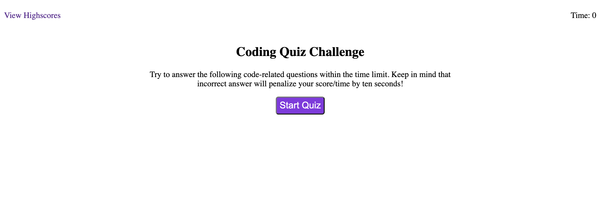
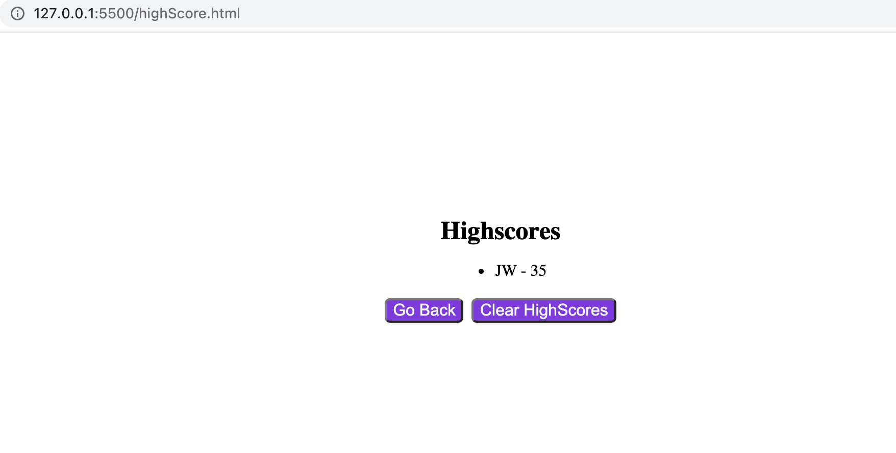

# Coding-Quize-Challenge

## Description

In this project, my task is to build a quiz application on JavaScript fundamentals. Besides, the new high score will store in local storage and display in high score page.

## Requirements

1. Click the start bottom to start quiz.
2. When presented question, timer started count.
3. Time is subtracted when answer a question incorrectly.
4. When game is over, save initial and score.

## Link URL to GitHub Repository

https://github.com/jingwang6028/Coding-Quiz-Challenge

## Link URL to the GitHub Page

https://jingwang6028.github.io/Coding-Quiz-Challenge/

## Mock up Image

This page shows the quiz application's appearance and functionality.

This page shows the high score page appearance and functionality.

